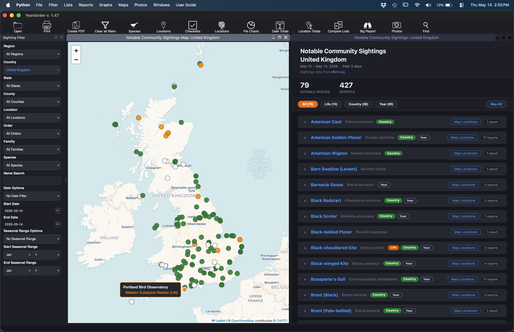

<table><tr>
<td></td>
<td></td>
<td></td>
<td></td>
<td></td>
<td></td>
<td></td>
</tr></table>

# Yearbirder

**Current release: v1.50** (May 2026)

A desktop application for exploring and analysing your personal [eBird](https://ebird.org) data and bird photos.

Yearbirder lets you filter, browse, and visualise your personal eBird sightings in ways the eBird website does not — across every location, species, date, and season in your personal history. If you are a bird photographer, Yearbirder also lets you sort, filter and view your photos in the same way.

---

## What's New in v1.50

- **Community → Species List** — The former "Regional Taxonomy" report has been renamed **Species List** and is now at **Community → Species List**.
- **Species List in Community Sightings Explorer** — The Explorer now includes a **Species List** button. Opens the eBird species checklist for the selected region with seen/photo badges reflecting only your own sightings in that country or state; no badges are shown for regions where you have no sightings.
- **Satellite and Reset controls on Location and Big Report maps** — The map tab in the Location window and the Big Report window now has the same **Satellite/Map** toggle and **Reset** button found on all other Yearbirder maps.
- **User Guide keyboard shortcut** — Press **Cmd-?** (Mac) or **F1** (Windows/Linux) to open the User Guide.
- **eBird button on checklists** — The Checklists List now has a green **eBird** button on every row that opens that checklist on the eBird website. A matching button appears in the sidebar when viewing a single checklist's species list. Requires an eBird API key.
- **Statistics — file date information** — The Statistics report now shows the download date of your eBird data file and the time of your most recent sighting at the bottom of the sightings column. When a photo catalog is open, the date the catalog was last updated appears at the bottom of the photos column.

## What's New in v1.492

- **Windows: eBird API fixed** — Resolved a Windows-only issue where all Community features silently failed to contact the eBird API in the installer build due to SSL certificate handling in the bundled runtime.
- **Windows: map tile backgrounds fixed** — Resolved a Windows-only issue where sightings maps, hotspot maps, animated maps, and choropleth maps showed a plain grey background instead of the map tile layer.

## What's New in v1.49

- **Community menu** — A new **Community** menu consolidates the reports that contact eBird's servers: Regional Taxonomy, Notable Community Sightings (Past 3 days), All Community Sightings (Past 3 days), Hotspot Map, and Community Sightings Explorer. All community features require a free eBird API key (set in Preferences).
- **Hotspot Map** — A new **Community → Hotspot Map** command displays all public eBird hotspots in the selected region as bubble markers, with each bubble sized by checklist count. Also accessible from the Community Sightings Explorer. Requires an eBird API key.
- **Species List** — The former “Regional Species” report was renamed and moved to **Community → Species List** (previously “Regional Taxonomy”). When a specific eBird location is selected in the Sighting Filter, the report queries that exact location’s species list. Private locations are automatically detected and labelled “(Personal Location)” in the report header.
- **”(Past 3 days)” labelling** — The Notable Community Sightings and All Community Sightings menu items and Explorer buttons now include “(Past 3 days)” to make the reporting window explicit.
- **Single-location All Community Sightings** — When a specific location is selected, the All Community Sightings report now shows **All-time List** and **Map** buttons in the header, opening the Species List and Hotspot Map respectively for that location — even when no checklists have been submitted in the past three days.
- **Community Sightings Explorer** — Now includes a **Hotspot Map** button alongside the existing Notable and All Community Sightings buttons.
- **Photo Filter keyboard shortcut** — Press **Cmd-P** (Mac) or **Ctrl-P** (Windows) to show or hide the Photo Filter panel.
- **Badge display fixes** — Corrected several bugs where Life, State, County, and Year badges on the Notable Community Sightings and All Community Sightings reports showed incorrect results, including cases where the wrong region's data was used to evaluate firsts.

## What's New in v1.48

- **Community Sightings Explorer** — A new **Community Sightings Explorer…** window lets you browse Notable and All Community Sightings for any region in the world, independently of the Sighting Filter. Pick a country, then optionally a state/province and county from cascading drop-downs (countries are loaded from the eBird API with United States and Canada sorted to the top). Requires a free eBird API key.
- **Clickable species names in community reports** — In both the Notable Community Sightings and All Community Sightings reports, clicking a species common name (shown in blue) opens an **Individual Species** window for that species. If the species is not in your own data, clicking it does nothing. Hybrid species names remain non-clickable.
- **Lifer sort fixed in All Community Sightings** — Life-bird species are now sorted correctly in taxonomic order in the All Community Sightings report. Previously, lifers sorted to the bottom of the list due to a missing taxonomic order lookup.
- **Removed redundant Reports count** — The All Community Sightings header no longer shows a Reports count (which always equalled the species count, since the eBird API returns one entry per species).

## What's New in v1.47

- **Regional Taxonomy report** — Generates an interactive species checklist for the currently selected region using live eBird API data. Seen species are marked with a checkmark; unseen species appear in grey. When a photo catalog is open, a blue dot marks each species you have photographed. Filter buttons let you focus on seen, unseen, photographed, or not-yet-photographed species. Requires a free eBird API key (set in Preferences).
- **eBird API key in Preferences** — A new field in Preferences stores your personal eBird API key, required for community reports. Get a free key at [ebird.org/api/keygen](https://ebird.org/api/keygen).
- **Notable Community Sightings** — **Community → Notable Community Sightings (Past 3 days)** queries the eBird API for species flagged as notable in the selected region over the past three days, sorted taxonomically. Colour-coded badge bubbles mark Life, State, County, and Year firsts relative to your data. Click **+** to expand each species’ checklist entries; duplicate entries (same location, time, and observer) are removed automatically. Hybrid species appear in grey without badges. Requires an eBird API key.
- **All Community Sightings** — **Community → All Community Sightings (Past 3 days)** shows every species reported in the selected region over the past three days, one row per species showing the most recent sighting. An **All Locations** button opens a new window listing all sightings of that species across the region. The same taxonomic ordering, badge bubbles, and filter bar from Notable Sightings apply here too. Requires an eBird API key.

## What's New in v1.44

- **Animated First Sightings Map** — a new animated map that plays back the first sighting of each species under the current filter; unlike the Animated Lifer Map (which always shows life lifers), this map respects your active filter, so you can watch your county firsts, year firsts, or any filtered species list accumulate chronologically
- **Animated map tooltips** — during playback of either animated map, a tooltip tracks each newly plotted species, showing its name, rank, date, and location
- **Fix** — crash in Animated Sequence Map with large photo collections

## What's New in v1.41

- **Photo catalog safeguards** — a series of fixes prevents accidental data loss when opening, switching, or closing photo catalogs; the app now guards against overwriting an existing catalog when a new eBird data file is opened
- **No catalog, no problem** — adding photos without a catalog open now prompts you to create one before saving; if you cancel, your in-progress work is preserved and you can try again
- **Unsaved-changes protection** — closing the Manage Photos window or the photo catalog while changes are pending now asks whether to save or discard, rather than silently discarding
- **Catalog-switching guard** — opening a different photo catalog while Manage Photos is open is blocked to prevent conflicts; switching catalogs with unsaved changes prompts to save first
- **CSV catalogs must be converted** — legacy CSV photo catalogs must now be converted to the new `.jsonl` format before they can be used; the app guides you through the conversion and will not open a CSV without it
- **Default catalog tracking fixed** — declining "Set as default catalog?" now correctly preserves the previous default; the Preferences dialog always shows the stored default rather than the currently open catalog
- **Menu visibility** — the Photos menu, Close eBird Data File, and catalog-related File menu items are now shown and hidden based on what is actually open, reducing clutter

## What's New in v1.4

- **eBird species code in Rename Photos** — the Species Name Format picker now includes *eBird Species Code* (e.g. `gretit1`) alongside Common Name and Scientific Name
- **Smarter photo-to-species matching** — when adding photos to the catalog, filename matching now checks eBird codes, BBL banding codes, common names, and scientific names as substrings, handling arbitrary filename patterns from any camera or workflow; previously only whole-word token matching was used
- **Duration-aware checklist matching** — photo EXIF timestamps are now matched to the checklist whose *window* (start time + duration) is closest, so a photo taken mid-checklist correctly matches that checklist rather than the next one to start
- **Sighting Filter** — the filter panel is now labelled *Sighting Filter* to distinguish it from the Photo Filter
- **Chart names updated** — photo-related charts are now named *Families & Orders by Photos*, *Total Photos*, *New Species Photographed Each Year*, and *Photographed Species Growth Over Time*

---

## Features

- **Species, Locations, and Checklists lists** — sortable, filterable tables of your sightings
- **Individual Species window** — full sighting history, location and year breakdowns, monthly patterns, and photo thumbnails for any species
- **Location window** — complete sighting history for a single location, with species list, yearly and monthly breakdowns, and a map showing the site
- **Date Totals** — species counts by year, month, and individual date
- **Location Totals** — species counts by region, country, state, county, and named location
- **Powerful filter panel** — filter everything simultaneously by region, country, state, county, location, taxonomic order, family, species, date range, and seasonal range; the Date Options picker includes a **Select Year** mode that reveals a second dropdown listing every year in your data, so you can filter to any specific calendar year in one step
- **Big Report** — comprehensive multi-tab report combining species, dates, locations, and checklists
- **Compare Lists** — compare any two species lists side by side
- **Species List** — interactive regional species checklist from the eBird API showing seen/unseen status and, when a photo catalog is open, photographed status; filter by seen, unseen, photographed, or not-yet-photographed. When a specific location is selected, queries that location directly; private locations are labelled "(Personal Location)"
- **Hotspot Map** — map of public eBird hotspots in the selected region, with bubbles sized by checklist count; accessible from the Community menu or the Community Sightings Explorer
- **Community Sightings Explorer** — browse Notable and All Community Sightings, open a Species List, or open a Hotspot Map for any country, state/province, or county worldwide, independently of the Sighting Filter; country list loaded live from the eBird API with US and Canada at the top
- **Notable Community Sightings** — live eBird report of species flagged as notable in the selected region over the past three days; Life/State/County/Year badge bubbles highlight firsts relative to your data; collapsible checklist entries; duplicate entries removed automatically; click any blue species name to open an Individual Species window
- **All Community Sightings** — live eBird snapshot of every species reported in the selected region in the past three days; one row per species showing the most recent sighting; All Locations button for per-species detail; same taxonomic ordering and badge bubbles as the Notable report; click any blue species name to open an Individual Species window
- **Graphs** — fourteen chart types:
  - *Total Species Bar Graph* — species count per year
  - *Cumulative Species Curve* — cumulative species seen over time
  - *Species Heatmap* — species count by month and year
  - *Species Accumulation* — new species added each year vs. repeats
  - *Top Locations* — top 20 locations by species count
  - *Checklist Scatter* — duration vs. species count per checklist, coloured by season
  - *Locations by Species & Checklists* — locations plotted by species count vs. checklist count
  - *Species by Locations & Count* — species plotted by distinct location count vs. individual count
  - *Phenology Chart* — sighting dates by day-of-year across years
  - *First of Year Chart* — first sighting of each species per year, plotted by month
  - *Last of Year Chart* — last sighting of each species per year, plotted by month
  - *Pie Chart by Species* — species count by taxonomic family or order
  - *Pie Chart by Individual Tallies* — individual bird count by taxonomic family or order
  - *Locations by Checklists* — checklist count by location as a pie chart
  - *YTD Reports* — horizontal bar charts comparing year-to-date species, locations, checklists, and photographs across all years in your data
- **Maps** — nine interactive map types:
  - *Locations Map* — all your sighting locations plotted on a zoomable map
  - *Animated Lifer Map* — watch your life list build up chronologically, dot by dot
  - *Animated First Sightings Map* — like the Lifer Map but filter-aware; animate county firsts, year firsts, or any filtered species list
  - *Effort Map by Time* — bubble map sized by cumulative birding time per location
  - *Effort Map by Checklists* — bubble map sized by checklist count per location
  - *Species Total Map* — bubble map sized by species total per location
  - *Individuals Total Map* — bubble map sized by individual bird count per location
  - *Choropleth by Species* — US states, US counties, Canada, India, Great Britain, and world countries shaded by species count
  - *Choropleth by Checklists* — same regions shaded by checklist count
- **Photos** — associate your JPEG bird photos with your sightings; browse, filter, and rate them by camera, lens, aperture, shutter speed, focal length, and ISO; **File → Open Photo Catalog** defaults to the photo catalog directory stored in Preferences
  - *Browse Photos* — thumbnail gallery of every photo matching the current filter, sortable by taxonomy, date, rating, or name
  - *Species Gallery* — one best-rated photo per species, arranged in taxonomic order; click any tile to see all photos of that species
  - *Geolocated Photos* — geotagged photos plotted on a clustered interactive map; hover for a thumbnail preview, click to open the full enlargement
  - *Batch Edit Photos* — edit species, date, time, location, or rating for multiple photos at once
  - **Adding photos** — when adding photos to the catalog, Yearbirder automatically suggests the species by matching the filename against the closest checklist using the EXIF timestamp; matching checks eBird species codes (e.g. `gretit1`), BBL banding codes, common names, and scientific names as substrings, handling arbitrary filename patterns from any camera or workflow
  - **Rename Photos** — batch-rename photo files using configurable components including date, time, species name, and location; the species name component supports **Common Name**, **Scientific Name**, or **eBird Species Code** format
- **Print and PDF export** — export any window to the printer or a PDF file

---

## Download

A pre-built, signed, and notarized macOS app is available on the [Releases page](https://github.com/trinkner/yearbird/releases/latest).

Download `Yearbirder.dmg`, open it, and drag Yearbirder to your Applications folder.

---

## Requirements

- Python 3.10 or later (download from [python.org](https://www.python.org/downloads/))
- [PySide6](https://pypi.org/project/PySide6/) — Qt 6 bindings (LGPL)
- [folium](https://pypi.org/project/folium/)
- [matplotlib](https://pypi.org/project/matplotlib/)
- [numpy](https://pypi.org/project/numpy/)
- [natsort](https://pypi.org/project/natsort/)
- [piexif](https://pypi.org/project/piexif/)

After installing Python, install all other dependencies with:

```
pip install pyside6 folium matplotlib numpy natsort piexif
```

---

## Running Yearbirder

```
python3 yearbirder.py
```

---

## Getting Your eBird Data

1. Go to [https://ebird.org/downloadMyData](https://ebird.org/downloadMyData)
2. Click **Request My Observations**
3. eBird will email you a link to download a `.csv` file containing your complete sightings history
4. In Yearbirder, click **File → Open** and select that file — if you have set a default eBird data folder in Preferences, the dialog will open there automatically

---

## Building a Standalone App (macOS)

Yearbirder uses [PyInstaller](https://pyinstaller.org) to create a distributable `.app` bundle. From the project root directory:

```
pyinstaller Yearbirder.spec
```

The finished app will be in `dist/Yearbirder.app`.

---

## License

Yearbirder is free, open-source software licensed under the [GNU General Public License v3](https://www.gnu.org/licenses/gpl-3.0.html).

Created by Richard Trinkner.
